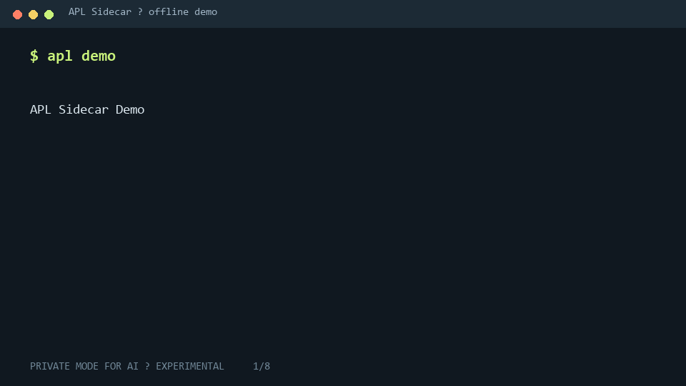

# APL Sidecar

> Private Mode for AI

  

**Licensing (layered):** runtime is Fair Source (FSL-1.1-ALv2); the verifier
(`packages/apl-verifier/`) is permanently Apache-2.0; the specification
(`spec/`) is CC BY 4.0. Details in [LICENSING.md](LICENSING.md).

## Your prompt has a blast radius.

Every request to an external AI is a disclosure.

APL shows what leaves your machine, splits sensitive tasks across providers, stitches the result locally, and gives you a receipt you can verify offline.

```bash
pip install apl-sidecar
apl demo
```

From source (development):

```bash
git clone https://github.com/OIA-LAB/apl-sidecar.git
cd apl-sidecar
python -m pip install -e .
apl demo
```

**SEE** what each provider receives  
**KEEP** final assembly local  
**VERIFY** the disclosure trail offline  
**BREAK** the receipt and watch verification fail

Don't trust the receipt? Good. Break it yourself:

```bash
apl break-receipt apl-out/receipt.json
```

APL controls and records task exposure. It does not guarantee anonymity, zero trace, or resistance to intent reconstruction.

We publish [what we refuse to claim](docs/claims-and-limits.md).

## Demo GIF



The demo is deterministic, uses bundled fictional data and offline mock providers, and requires no account, API key, or external network call.

## 60-second quickstart

Requires Python 3.11 or newer.

```bash
pip install apl-sidecar
apl demo
```

(From a source checkout, use `python -m pip install -e .` instead.)

APL writes exactly three primary artifacts to `apl-out/`:

```text
apl-out/
├── exposure.html
├── receipt.json
└── assessment.md
```

Then inspect or verify them:

```bash
apl inspect apl-out
apl verify apl-out/receipt.json
```

`pip install apl-sidecar` (or `pipx install apl-sidecar` for an isolated CLI)
is the primary, published-package path — it pulls the wheel from PyPI, and
`apl demo` runs the bundled fictional scenario with no source checkout needed.
Use `python -m pip install -e .` only when working from a source clone. The
`examples/`- and `spec/`-relative "Verify it yourself" commands in each
scenario's README assume a source checkout; a pip-install user should start
from `apl demo` and verify the receipt it writes to `apl-out/`.

## What each provider saw

Open `apl-out/exposure.html` and switch between:

- **Full Local View** — original task, disclosure plan, local-only context, both fragments and outputs, local stitch, and receipt.
- **Provider A View** — only Provider A input, metadata, and output.
- **Provider B View** — only Provider B input, metadata, and output.

Each view labels information as `ORIGINAL`, `DERIVED`, `REDACTED`, `SENT`, `RECEIVED`, `LOCAL`, `INFERRED`, or `VERIFIED`.

## Break the receipt

```bash
apl break-receipt apl-out/receipt.json
```

This preserves the original receipt, creates `receipt.tampered.json`, changes one meaningful field, and runs the offline verifier. Output excerpt:

```text
Changed field: provider_events[0].payload_sha256
Verification failed: receipt was modified or signature is invalid.
```

The original still succeeds:

```bash
apl verify apl-out/receipt.json
```

`apl break-receipt` returns `0` when the generated tampered copy is rejected as expected. A non-zero code means the demonstration itself failed—for example, the source could not be read, could not be tampered with, or the tampered receipt unexpectedly verified. Use `apl verify` to validate a normal receipt.

## What just happened?

```text
PASTE / bundled fictional task
  ↓
SPLIT / curated controlled disclosures
  ↓
SEE / exact Provider A and Provider B views
  ↓
STITCH / deterministic fixture output reassembled locally
  ↓
RECEIPT / signed Ed25519 disclosure record
  ↓
VERIFY / offline hash and signature verification
```

The v0.1 split is user-guided and fixture-backed. Automatic semantic decomposition is not claimed.

## Three generated artifacts

- `exposure.html` is a self-contained visual record with three perspectives, disclosure flow, local stitch, receipt status, and residual-risk summary.
- `receipt.json` is the signed receipt produced by the APL signing path.
- `assessment.md` is a deterministic exploratory reconstruction assessment that states recovered signals, missing context, confidence, residual risk, and method.

## Exposure metrics

The signed receipt uses normalized character-count ratios defined in [the exposure model](docs/exposure_model.md). The viewer also presents transparent `ceil(characters / 4)` token estimates for developer orientation.

For the bundled scenario, Provider A and Provider B receive different partial inputs. Disclosure volume is shown separately from reconstruction risk. APL never transforms a disclosure ratio into “percent safer” or a privacy guarantee.

## OpenAI-compatible example

Route a tested OpenAI-compatible request through the local APL Sidecar after starting the offline proxy:

```bash
apl proxy --port 8793
```

```python
from openai import OpenAI

client = OpenAI(base_url="http://127.0.0.1:8793/v1", api_key="local")
response = client.chat.completions.create(
    model="apl-mock-a",
    messages=[{"role": "user", "content": "Analyze this confidential task..."}],
)
print(response.choices[0].message.content)
```

The current integration surface implements `GET /v1/models` and non-streaming `POST /v1/chat/completions` for two offline mock models. It does not claim universal OpenAI-client compatibility.

## How it works

The bundled scenario supplies an original fictional task, a masking plan, declared local-only fields, two distinct provider payloads, deterministic mock answers, and a local final artifact. `apl demo` routes both payloads through the `ProviderRegistry`, rejects network-enabled adapters, reintroduces local context only on the machine, signs the receipt, verifies it, and renders the three artifacts.

## What the receipt proves

APL demonstrates:

- what payload the runtime prepared for each provider;
- what payload the configured adapter recorded as sent;
- which response hashes entered the run;
- which local-only field fingerprints were recorded;
- measured character disclosure volume under this run;
- whether the receipt remains internally consistent and its Ed25519 signature verifies.

See [the receipt standard](RECEIPT_STANDARD.md).

## What the receipt does not prove

APL does not prove:

- that a provider deleted data or did not log it elsewhere;
- that task intent cannot be reconstructed;
- that providers do not collude;
- that all semantic information was removed;
- cryptographic secrecy of task intent;
- regulatory compliance, legal non-liability, or universal provider compatibility.

See [claims and limits](docs/claims-and-limits.md).

## Reconstruction assessment

`assessment.md` is deliberately exploratory. It reports recovered entities, relationships and objectives; missing context; a qualitative reconstruction confidence; residual risk; and the exact offline method. It never emits a standalone `SAFE`, `PRIVATE`, or `SECURE` verdict.

Disclosure volume and reconstruction risk are different measurements.

## Architecture

```text
existing scenario fixtures
        ↓
ProviderRegistry → offline mock adapters
        ↓
receipt builder → Ed25519 signer → reference verifier
        ↓
local fixture-backed stitch
        ↓
exposure.html + receipt.json + assessment.md
```

The local OpenAI-compatible proxy is an integration surface, not the product itself.

## Provider adapters

The protocol is defined in `adapters/base.py`, registration is explicit in `adapters/registry.py`, and bundled offline adapters live in `adapters/mock.py`. Unknown plugins are never auto-loaded.

> Add a provider adapter without changing the APL runtime.

Read [the provider adapter guide](docs/provider-adapters.md).

## BYOK reference: run-live

`apl run-live` is the reference implementation of the real-provider path the
security model requires: an explicit opt-in command (never a default), a leak
gate shared with `apl mask`, a pre-flight disclosure preview with typed
consent, environment-only keys scrubbed from every error path, and a signed
`live_response` receipt that is verified before the command reports success —
and written even when a provider call fails. There is no silent fallback from
mock to live.

Read [the BYOK reference guide](docs/byok_reference.md).

## Scenario packs

The existing `examples/<scenario>/` layout is the scenario-pack boundary. A scenario can be contributed without modifying the core runtime when it supplies the documented original, plan, local-only fields, provider payloads, fixture responses, local result, and receipt fixtures.

Read [the scenario-pack guide](docs/scenario-packs.md).

## Security model

Default demo behavior is network disabled, offline mock providers only, local output only, no telemetry, no account, and no API key. Any future real-provider path must require an explicit network opt-in and a preview warning; there is no silent fallback to live providers.

Private Mode is a product mental model, not a zero-trace promise. APL cannot hide account, IP, or network metadata or control provider retention. See [SECURITY.md](SECURITY.md) and [claims and limits](docs/claims-and-limits.md).

## N-way fragmentation (2-5 seats)

Tasks that separate into independent workstreams can split across up to
five seats (`examples/02_market_entry_three_way` ships a three-way plan;
run-live names every seat: `--seat pricing=anthropic --seat channel=openai
--seat risk=openai`). Splitting lowers the measurable per-seat disclosure
share, signed into the receipt; it does not by itself guarantee lower
reconstruction risk, and seats that resolve to the same trust domain have
their exposure aggregated -- the receipt records that too. Numbers, hard
limits, and the trust-domain rule: [docs/fragmentation.md](docs/fragmentation.md).

## Enterprise Gateway

The Fair Source (FSL-1.1-ALv2) Sidecar demonstrates the runtime mechanism. Enterprise deployment, organization-wide policy, audit workflows, and provider governance belong to the [APL Enterprise Gateway](docs/enterprise_gateway.md).

## Contributing

Start with [CONTRIBUTING.md](CONTRIBUTING.md). Useful contributions include provider adapters, fictional scenario packs, verifier conformance vectors, accessibility improvements, and tests that sharpen product boundaries.

## License

Layered — see [LICENSING.md](LICENSING.md). In short: the runtime is Fair Source
(FSL-1.1-ALv2, see [LICENSE](LICENSE)); the verifier is permanently Apache-2.0;
the specification is CC BY 4.0. The v0.1.0 release remains MIT, unchanged. All
bundled scenario content is fictional and synthetic.
